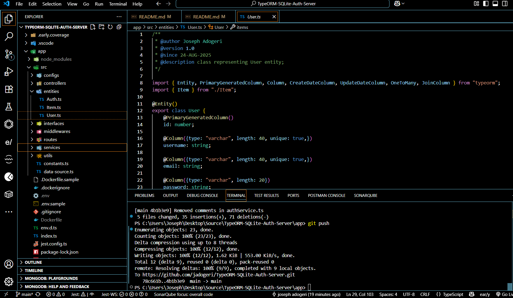
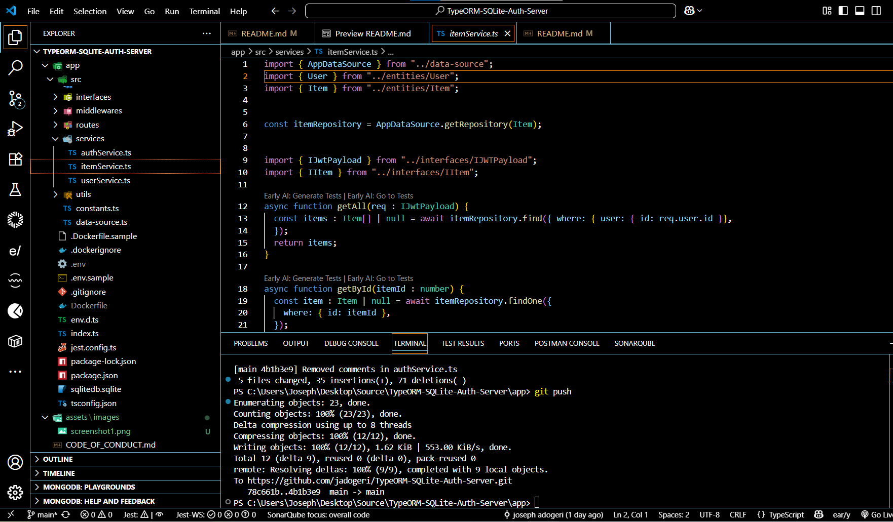
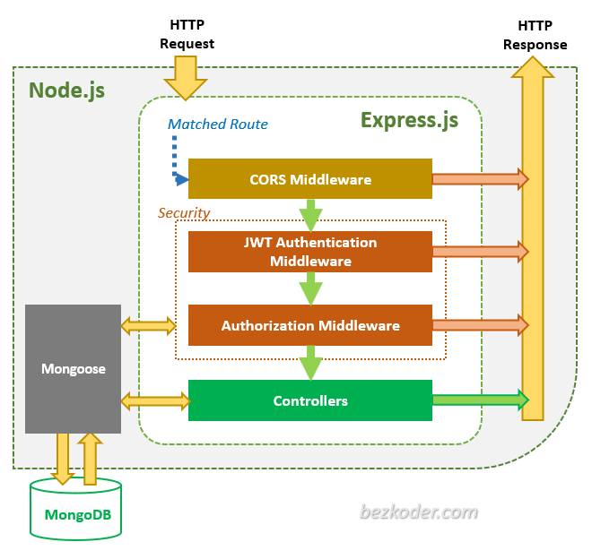
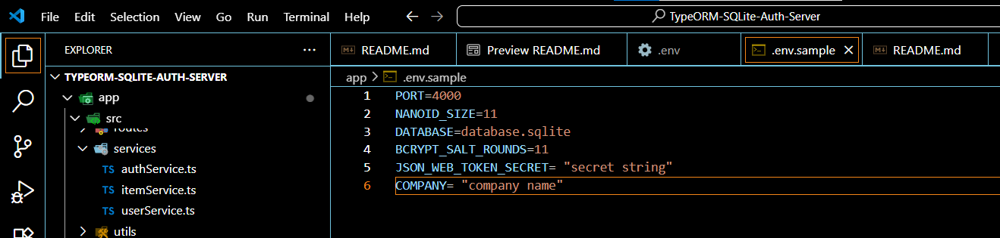
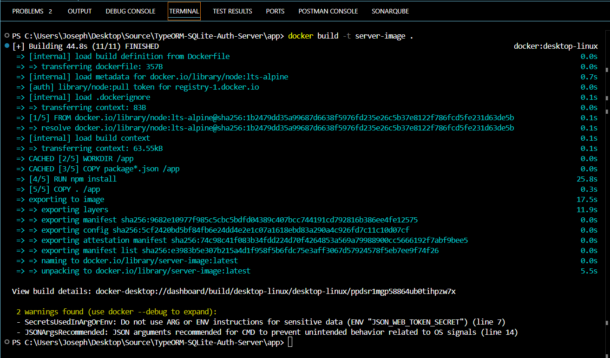
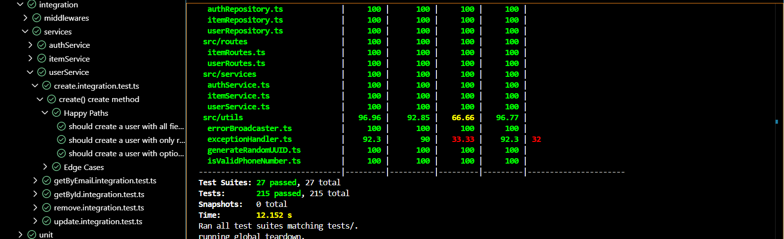

# **System Design Document (SDD)**

## **Contact Management App**

**Version:** 1.1
**Date:** March 22, 2025

---

## Description

This is a template for Backend Application (Express + Node + Mongoose) which stores user information and contacts.

## Authors

- [@jadogeri](https://www.github.com/jadogeri)

## Screenshots

|  |  |
| -------------------------------------------- | -------------------------------------------- |
|                                              |                                              |

## Table of Contents

<ul>
      <li><a href="#1-introduction">1. Introduction</a>
        <ul>
          <li><a href="#11-purpose">1.1 Purpose</a> </li>
          <li><a href="#12-scope">1.2 Scope</a> </li>
          <li><a href="#13-intended-audience">1.3 Intended Audience</a> </li>
        </ul>
      </li>
    </ul>
    <ul>
      <li><a href="#2-api-reference">2. API Reference</a>
      </li>
    </ul>
    <ul>
      <li><a href="#3-system-architecture">3. System Architecture</a>
        <ul>
          <li><a href="#31-high-level-architecture">3.1 High Level Architecture</a> </li>
          <li><a href="#32-technology-stack">3.2 Technology Stack</a> </li>
          <li><a href="#33-deployment-artifacts">3.3 Deployment Artifacts</a> </li>
        </ul>
      </li>
    </ul>
    <ul>
      <li><a href="#4-data-design">4. Data Design</a>
        <ul>
          <li><a href="#41-data-entities-and-relationships">4.1 Entities and Relationships</a> </li>
          <li><a href="#42-database-conceptual-schema">4.2 Database Conceptual Schema</a> </li>
          <li><a href="#33-deployment-artifacts">3.3 Deployment Artifacts</a> </li>
        </ul>
      </li>
    </ul> 
    <ul>
      <li><a href="#5-installation">5. Installation</a>
      </li>
    </ul> 
    <ul>
        <li><a href="#6-usage">6. Usage</a>
        <ul>
            <li><a href="#61-run-application">6.1 Run Application</a> </li>
            <ul>
              <li><a href="#611-run-locally">6.1.1 Run Locally</a> </li>
              <li><a href="#612-run-docker-container">6.1.2 Run Docker Container</a> </li>
            </ul>
        </ul>
        </li>
    </ul> 
    <ul>
        <li><a href="#7-api-testing">7. API Testing</a>
        </li>
    </ul> 
    <ul>
        <li><a href="#8-tests">8. Tests</a>
        </li>
    </ul>  
    <ul>  
        <li><a href="#9-license">9. License</a>
        </li>
    </ul> 
    <ul> 
        <li><a href="#10-references">10. References</a>
        </li>
    <ul>

## **1. Introduction**

### **1.1 Purpose**

This document outlines the system architecture, components, and design considerations for Contact Management App. The goal is to provide a template for backend developers to handle CRUD operations and authentication flow.

### **1.2 Scope**

The system will allow users to:

- Create user account.
- Handle authentication flow.
- Provide security to user data.

### **1.3 Intended Audience**

- Junior or Senior backend developers.
- beginners learning typescript.

---

## **2. API Reference**

* [Link to Documentation ](https://documenter.getpostman.com/view/40822092/2sAYXEEdwL)

## **3. System Architecture**

### **3.1 High-Level Architecture**

The system follows a **three-tier architecture**:

1. **Presentation Layer**: This layer directly interacts with incoming HTTP requests, defines routes using Express's routing mechanism, and sends back the final response to the client.
2. **Application Layer**: This layer encapsulates the core business logic, performing operations like data validation, calculations, and complex data manipulation, typically called by the route handlers in the presentation layer.
3. **Data Layer**: This layer handles communication with the database, performing CRUD operations to retrieve and store data.



### **3.2 Technology Stack**

- **Programming Languages**: Typescript, NOSQL, YAML
- **IDE**: Visual Studio Code (VSCode)
- **Backend Frameworks**: Node and Express
- **Database**: MongoDB
- **Test**: Jest, MockingGoose, Mongo Memory Server and Supertest
- **Plugins**: Early AI
- **Container**: Docker
- **Security**: JSON Web Token (JWT), Bcrypt and Nanoid
- **Hosting**: Render.com
- **Source Control**: Git and GitHub
- **CI/CD**: GitHub Actions
- **Code Analsis**: SonarQube

### **3.3 Deployment Artifacts**

- **Backend Application**: Appllicationcontains everyting to build and run Express application instance on Render.com or build a Docker image, and run a Docker container on Render.com

---

## **4. Data Design**

### **4.1 Data Entities and Relationships**

| Entity  | Description                                          |
| ------- | ---------------------------------------------------- |
| USER    | User account information used to authenticate users. |
| AUTH    | Saves authentication information of Users.           |
| CONTACT | Contact information saved by User                    |

---

## **5. Installation**

* [Download and install NodeJS](https://nodejs.org/en/download)
* [Download and install Docker - Windows](https://docs.docker.com/desktop/setup/install/windows-install/)
* [Download and install Docker - Mac](https://docs.docker.com/desktop/setup/install/mac-install/)
* [Create MongoDB account and connection string](https://www.mongodb.com/docs/drivers/node/current/quick-start/)
* [Create Google account](https://google.com/)
* [Generate Google account App Password](https://support.google.com/mail/thread/205453566/how-to-generate-an-app-password?hl=en)
* [Twilio Account - API for SMS (Optional)](https://www.twilio.com/en-us/messaging/programmable-messaging-api)
* [PostMan - API Testing](https://www.postman.com/downloads/)

---

## **6. Usage**

**Prerequisites** :installation of NodeJS and MongoDB atlas account

### **6.1 Run Application**

1 Open command prompt or terminal.

2 Type command git clone https://github.com/jadogeri/Contact_Management_App.git then press enter.

```bash
  git clone https://github.com/jadogeri/Contact_Management_App.git
```

3 Enter command cd Contact_Management_App then press enter.

```bash
  cd Contact_Management_App
```

#### **6.1.1 Run Locally**

1 Add .env file in project root directory and copy contents in .env.sample.

2 Fill out connection_string with mongoDB atlas MONGODB_URI and create a secret phrase for JSON_WEB_TOKEN_SECRET.



3 Type npm install to install dependencies.

```bash
  npm install
```

4 Type npm run dev to run server

```bash
  npm run dev
```


#### **6.1.2 Run Docker container**

1 Add Dockerfile file in project root directory and copy contents in .Dockerfile.sample.

2 Fill out connection string with mongoDB atlas MONGODB_URI and create a secret phrase for JSON_WEB_TOKEN_SECRET.


3 Type docker build -t server-image . in command line to build docker image.

```bash
  docker build -t server-image .
```



3 Type docker run --name server-container -d -it -p 6000:6000 server-image to create and start container immediately.

```bash
  docker run --name server-container -d -it -p 6000:6000 server-image
```


4 Type docker stop server-container to stop container.

```bash
  docker stop server-container
```

5 Type docker start server-container to start container.

```bash
  docker start server-container
```

## **7. API Testing**

**Prerequisites** :ensure container or local application is running.

**Note** : use `<a href="#2-api-reference">`API Reference `</a>` docs for testing endpoints.

#### **7.1.1 Postman Environment Variables**


---

## **8. Tests**

1. run test command below.

```bash
  npm run test
```



---

## **9. License**

[LICENSE](/LICENSE)

---

## **10. References**

* FreeCodeCamp : [Frontend Web Development: (HTML, CSS, JavaScript, TypeScript, React)](https://www.youtube.com/watch?v=MsnQ5uepIa).
* Dipesh Malvia : [Learn Node.js &amp; Express with Project in 2 Hours](https://www.youtube.com/watch?v=H9M02of22z4&t=140s).
* AweSome Open Source : [Awesome Readme Templates](https://awesomeopensource.com/project/elangosundar/awesome-README-templates)
* Readme.so : [The easiest way to create a README](https://readme.so/)
* Swagger :  [Swagger API Documentation](https://swagger.io/docs/)
* Supertest :  [Guide to writing integration tests in express js with Jest and Supertest](https://dev.to/ali_adeku/guide-to-writing-integration-tests-in-express-js-with-jest-and-supertest-1059#:~:text=In%20the%20root%20directory%20of,all%20your%20integration%20test%20files)
* MongoDB Memory Server Test Database : [Testing with MongoDB-Memory-Server ](https://dev.to/remrkabledev/testing-with-mongodb-memory-server-4ja2)
* Unit Testing : [Unit tests in Jest with supertest, MongoDB and TypeScript](https://medium.com/@adammalej/unit-tests-in-jest-with-supertest-and-mongodb-e4d56e918ce8)
* Mockingoose : [How to test mongoose models with jest and mockingoose](https://dev.to/darkmavis1980/how-to-test-mongoose-models-with-jest-and-mockingoose-2k10)
* MongoDB Memory Server :  [MongoDB Memory Server tutorial in typescript](https://github.com/typegoose/mongodb-memory-server)
